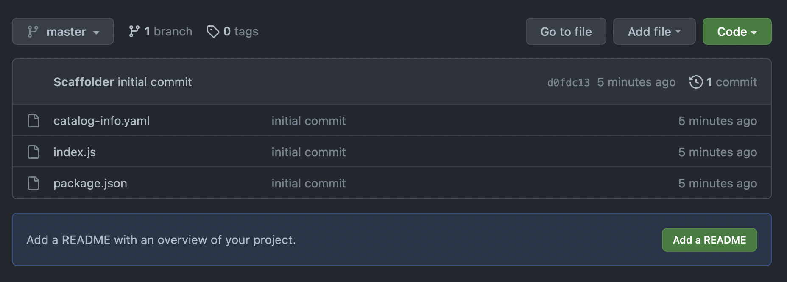

# Installation

## Pre-requisites

Backstage:
* `node` v16.17.1 (version proven to be working)
  * MacOS: `brew install node@16 && brew link --overwrite node@16`
* `yarn` v1.22.19 (version proven to be working)
* `docker`
* `git`
* `curl`

Others:
* `kind` to create a local cluster.
* `kubectl`
* `helm`

## Installation

### Kubernetes Cluster

Everything will run in a Kubernetes cluster but we can get away with our own
small local cluster.

```bash
kind create cluster
```

We'll deploy everything into our own namespace:
```bash
kubectl create namespace heroku
```

Point `kubectl` to that namespace so that we don't have to type it every time:
```bash
kubectl config set-context --current --namespace heroku
```

### Backstage

First, we need to create a Backstage application.
```bash
# It will ask the name of the folder it will store the app.
npx @backstage/create-app
```

Run!
```bash
# cd into your application folder first.
yarn dev
```

#### Github Integration

Github Apps is the best way to integrate with GitHub and will let you use Github
users in your auth story but it's a bit cumbersome. So, we will just give a
personal access token to Backstage and it will use that for all of its Github
operations.

1. Create a token in https://github.com/settings/tokens/new with all `repo` and
   `workflow` permissions.
    ```bash
    # First stop running `yarn dev` command with Ctrl+C
    export GITHUB_TOKEN=ghp_XXX
    ```
2. Make sure the following section exists in `app-config.yaml` file:
    ```yaml
    integrations:
      github:
        - host: github.com
          token: ${GITHUB_TOKEN} # this should be the token from GitHub
    ```
3. Start the Backstage app again.
    ```bash
    yarn dev
    ```

To make sure everything is tight, go to `http://localhost:3000/create` and
create a new component by using Node.js hello world template.




#### Deploy to Cluster

We need to build an image of our Backstage app and deploy it in our cluster.
Note that we will still use the in-memory sqlite database for brevity in this
tutorial, so every restart of the Backstage app will get us back to scratch.

We'd like to use in-memory sqlite for brevity and we need to enable template
importing, so your **full** `app-config.production.yaml`, which is used by 
`yarn build`should look like the following:
```yaml
app:
  baseUrl: http://127.0.0.1:7007

backend:
  baseUrl: http://127.0.0.1:7007
  listen:
    port: 7007
    host: 0.0.0.0

  database:
    # OK for tutorial, not OK for production.
    client: better-sqlite3
    connection: ':memory:'

catalog:
  rules:
    # We added Template to the original list so that we can add templates via the UI.
    - allow: [Component, System, API, Resource, Location, Template]
```

Build the app to produce an artifact.
```bash
# This will save artifacts to packages/*/dist folders.
yarn build
```

Use that artifact to create an image.
```bash
# This will take artifacts from packages/*/dist folders and install them
# in the image.
yarn build-image --tag muvaf/backstage-demo:v0.1.0
```

Load the image into our `kind` cluster so that it can be used in a `Pod` without
having to access an external image registry.
```bash
kind load docker-image muvaf/backstage-demo:v0.1.0
```

Now the image is in the cluster and ready to be deployed. Let's create the
Kubernetes manifests. Firstly, you need to create a `Secret` that holds our
Github personal access token.

```bash
cat <<EOF | kubectl apply -f -
apiVersion: v1
kind: Secret
metadata:
  name: backstage-github-token
  namespace: heroku
type: Opaque
stringData:
  GITHUB_TOKEN: ${GITHUB_TOKEN}
EOF
```

Now, let's deploy our Backstage app!
```yaml
apiVersion: v1
kind: Service
metadata:
  name: backstage
  namespace: heroku
spec:
  selector:
    app: backstage
  ports:
    - name: http
      port: 80
      targetPort: http
---
apiVersion: apps/v1
kind: Deployment
metadata:
  name: backstage
  namespace: heroku
spec:
  replicas: 1
  selector:
    matchLabels:
      app: backstage
  template:
    metadata:
      labels:
        app: backstage
    spec:
      serviceAccountName: backstage
      containers:
        - name: backstage
          image: muvaf/backstage-demo:v0.1.0
          imagePullPolicy: Never
          ports:
            - name: http
              containerPort: 7007
          env:
            - name: GITHUB_TOKEN
              valueFrom:
                secretKeyRef:
                  name: backstage-github-token
                  key: GITHUB_TOKEN
                  optional: false
            - name: POD_NAMESPACE
              valueFrom:
                fieldRef:
                  fieldPath: metadata.namespace
---
apiVersion: v1
kind: ServiceAccount
metadata:
  name: backstage
  namespace: heroku
```

Access the service from your local machine to make sure everything is tight!
```bash
kubectl port-forward --namespace=heroku svc/backstage 7007:80
```

The `ServiceAccount` will be necessary in the next steps to allow Backstage to
create objects in our cluster.

### ArgoCD

Backstage will create application instances whose code will live in a Git repo,
which means its Kubernetes manifests will live there as well. ArgoCD will
continuously sync those manifests to the application cluster.

Install ArgoCD to our cluster:
```bash
# kubectl is not able to change SA namespace given in ClusterRoleBinding.
kubectl create -n heroku -f https://raw.githubusercontent.com/argoproj/argo-cd/stable/manifests/install.yaml --dry-run -o yaml && | sed 's/namespace: argocd/namespace: heroku/g' | kubectl apply -f -
```

Call the following to get the initial `admin` password:
```bash
kubectl -n heroku get secret argocd-initial-admin-secret -o jsonpath='{.data.password}' | base64 -d; echo
```

Access ArgoCD UI with the following command:
```bash
kubectl port-forward svc/argocd-server -n heroku 8080:443
```

### Crossplane

We will use Crossplane to meet the infrastructure needs of our applications.

```bash
helm install crossplane --namespace heroku crossplane-stable/crossplane --wait
```

We are going to provision cloud infrastructure from Google Cloud. We need to
install a Crossplane provider to do that.

```bash
cat <<EOF | kubectl apply -f -
apiVersion: pkg.crossplane.io/v1
kind: Provider
metadata:
  name: provider-gcp
spec:
  package: xpkg.upbound.io/upbound/provider-gcp:v0.16.0
EOF
```

Wait till the provider pod comes up.
```
kubectl get pods -w
```

Next, we need to add our cloud credentials for GCP provider to use.

```bash
cat <<EOF | kubectl apply -f -
apiVersion: gcp.upbound.io/v1beta1
kind: ProviderConfig
metadata:
  name: default
spec:
  projectID: crossplane-playground
  credentials:
    source: Secret
    secretRef:
      namespace: heroku
      name: gcp-creds
      key: creds
EOF
```

You need to have your GCP Service Account token JSON to be available in
`BASE64_ENCODED_SA_JSON` environment variable as base64 encoded.
```bash
cat <<EOF | kubectl apply -f -
apiVersion: v1
kind: Secret
metadata:
  name: gcp-creds
  namespace: upbound-system
stringData:
  creds: ${BASE64_ENCODED_SA_JSON}
EOF
```