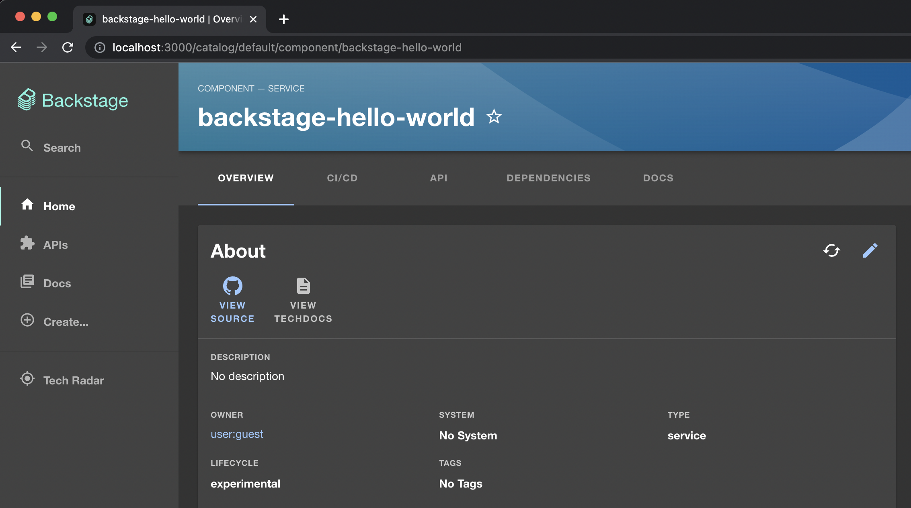

# Build your own Heroku with Cloud Native Stack

## Pre-requisites

Backstage:
* `node` v16.17.1 (version proven to be working)
  * MacOS: `brew install node@16 && brew link --overwrite node@16`
* `yarn` v1.22.19 (version proven to be working)
* `docker`
* `git`
* `curl`

Others:
* `kind` to create a local cluster.

## Installation

First, we need to create a Backstage application.
```bash
# It will ask the name of the folder it will store the app.
npx @backstage/create-app
```

Run!
```bash
# cd into your application folder first.
yarn dev
```

### Github Integration

Github Apps is the best way to integrate with GitHub and will let you use Github
users in your auth story but it's a bit cumbersome. So, we will just give a
personal access token to Backstage and it will use that for all of its Github
operations.

#### Allow Backstage to create/edit repos

1. Create a token in https://github.com/settings/tokens/new with all `repo` and
   `workflow` permissions.
2. Add it to `app-config.local.yaml` file which is `gitignore`d to avoid pushing
   it to anywhere.
      ```yaml
      integrations:
        github:
          - host: github.com
            token: TOKEN # this should be the token from GitHub
      ```

To make sure everything is tight, go to `http://localhost:3000/create` and
create a new component by using Node.js hello world template.



